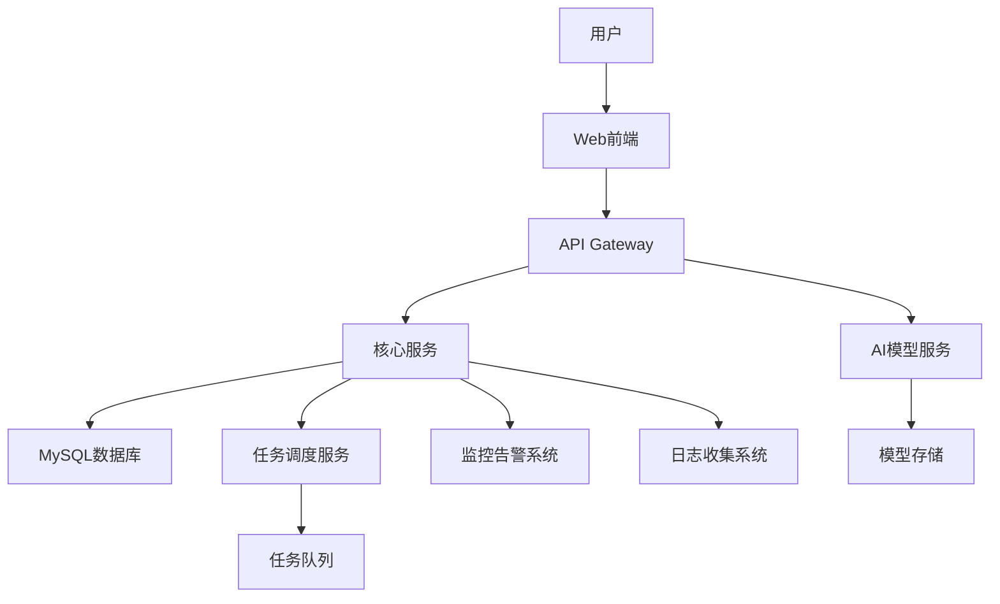

# 技术架构文档

## 1. 整体架构
采用前后端分离的微服务架构，主要包含以下组件：
- API Gateway
- 核心服务
- AI模型服务
- 工具管理服务
- 智能体配置服务
- 任务调度服务
- 监控告警系统
- 日志收集系统

## 2. 架构图

## 3. 技术选型说明
### 3.1 后端技术栈
- **Python 3.10**：基础编程语言
- **FastAPI**：高性能API框架，支持异步
- **Uvicorn**：ASGI服务器，支持WebSocket
- **MySQL**：关系型数据库，支持事务
- **SQLAlchemy**：ORM框架，支持多种数据库

### 3.2 前端技术栈
- **Vue 3**：渐进式前端框架
- **TypeScript**：强类型JavaScript超集
- **Vite**：现代构建工具

### 3.3 基础设施
- **Docker**：容器化部署
- **Kubernetes**：容器编排
- **Prometheus**：监控系统
- **Grafana**：可视化监控

## 4. 关键设计决策
1. 采用微服务架构，提高系统可扩展性
2. 使用API Gateway统一管理API请求
3. 异步任务处理，提高系统吞吐量
4. 完善的监控和日志系统，保证系统稳定性
5. 工具管理模块支持动态注册和发现
6. 智能体配置支持手动选择和自动选择工具
7. 模型API统一接入，支持多种模型协议
8. 提供标准API接口，支持系统集成
